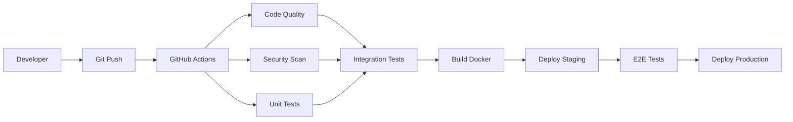

# エンタープライズ・システムアーキテクチャ設計書
**AI Engineer #9 + AI Test Engineer #10 担当領域**

## 🎯 技術戦略目標
- **スケーラビリティ**: 将来的な成長に対応可能な拡張性
- **信頼性・可用性**: 99.9%以上のサービス稼働率実現
- **保守性・可読性**: 開発生産性向上とメンテナンス効率化
- **セキュリティ**: エンタープライズレベルのセキュリティ対策

## 🏗️ システム全体アーキテクチャ

### アーキテクチャ概要図
```
┌─────────────────────────┐    ┌─────────────────────────┐
│     Frontend Layer      │    │      Mobile Apps        │
│  (React/Next.js/Vue)    │    │   (iOS/Android/PWA)     │
└─────────┬───────────────┘    └─────────┬───────────────┘
          │                              │
          └─────────────┬──────────────────┘
                        │
        ┌───────────────▼───────────────┐
        │        Load Balancer          │
        │      (CloudFlare/ALB)         │
        └───────────────┬───────────────┘
                        │
    ┌───────────────────▼───────────────────┐
    │           API Gateway                 │
    │    (Kong/AWS API Gateway)             │
    └───────────────────┬───────────────────┘
                        │
        ┌───────────────▼───────────────┐
        │       Microservices           │
        │  ┌─────────┬─────────┬─────────┐│
        │  │Auth Svc │User Svc │Data Svc ││
        │  └─────────┴─────────┴─────────┘│
        └───────────────┬───────────────┘
                        │
    ┌───────────────────▼───────────────────┐
    │         Data Layer                    │
    │ ┌─────────┬─────────┬─────────┬─────────┐│
    │ │ Primary │ Cache   │Analytics│ Queue   ││
    │ │   DB    │ (Redis) │  (DWH)  │(Kafka)  ││
    │ └─────────┴─────────┴─────────┴─────────┘│
    └───────────────────────────────────────┘
```

## 🔧 技術スタック詳細

### Frontend技術選定
| レイヤー | 技術選択 | 選定理由 | 代替案 |
|---------|----------|----------|--------|
| **Webフレームワーク** | Next.js 14 | SSR/SSG、TypeScript標準、Vercel最適化 | React, Vue.js |
| **状態管理** | Zustand + TanStack Query | 軽量、TypeScript親和性、キャッシュ管理 | Redux Toolkit, SWR |
| **UIライブラリ** | Tailwind CSS + Shadcn/ui | デザインシステム、カスタマイズ性 | Material-UI, Ant Design |
| **テスト** | Vitest + Testing Library | 高速、Jest互換、ESM対応 | Jest, Cypress |

### Backend技術選定
| レイヤー | 技術選択 | 選定理由 | 代替案 |
|---------|----------|----------|--------|
| **アプリケーション** | Node.js + Express/Fastify | JavaScript統一、豊富なエコシステム | Python, Go, Java |
| **API設計** | GraphQL + REST hybrid | 柔軟なデータ取得、型安全性 | REST only, gRPC |
| **ORM/データアクセス** | Prisma | 型安全、マイグレーション管理 | TypeORM, Drizzle |
| **認証・認可** | Auth0 / Supabase Auth | SaaS活用、OAuth/SAML対応 | Firebase Auth, 自作JWT |

### データ・インフラ技術選定
| レイヤー | 技術選択 | 選定理由 | 代替案 |
|---------|----------|----------|--------|
| **プライマリDB** | PostgreSQL | ACID準拠、JSON対応、拡張性 | MySQL, MongoDB |
| **キャッシュ** | Redis Cluster | 高性能、永続化、クラスタリング | Memcached, DragonflyDB |
| **メッセージキュー** | Apache Kafka | 高スループット、永続化、パーティション | RabbitMQ, AWS SQS |
| **コンテナ** | Docker + Kubernetes | 標準化、オーケストレーション | Docker Swarm, Nomad |
| **クラウド** | AWS/Multi-cloud | 豊富なサービス、グローバル展開 | GCP, Azure |

## 🎨 設計原則・パターン

### アーキテクチャ原則
1. **Single Responsibility**: 各サービスは単一責任を持つ
2. **Loose Coupling**: サービス間は疎結合で設計
3. **High Cohesion**: 関連機能は同一サービス内で凝集
4. **API First**: API設計を最優先で考慮
5. **Security by Design**: セキュリティを設計段階から組み込み

### 設計パターン
- **マイクロサービス**: ドメイン駆動設計（DDD）ベース
- **CQRS**: コマンドとクエリの責任分離
- **Event Sourcing**: イベント履歴による状態管理
- **Circuit Breaker**: 障害時の連鎖防止
- **Bulkhead**: リソース分離による障害耐性

## 🧪 品質保証・テスト戦略

### テスト自動化ピラミッド
```
        ┌─────────────────┐
        │   E2E Tests     │ <- 5%
        │   (Playwright)  │
        └─────────────────┘
      ┌───────────────────────┐
      │  Integration Tests    │ <- 15%
      │  (Supertest + DB)     │
      └───────────────────────┘
    ┌─────────────────────────────┐
    │      Unit Tests             │ <- 80%
    │  (Vitest + Jest)            │
    └─────────────────────────────┘
```

### テスト種別・カバレッジ目標
| テスト種別 | フレームワーク | カバレッジ目標 | 実行頻度 |
|-----------|---------------|---------------|----------|
| **単体テスト** | Vitest/Jest | 80%以上 | PR毎・CI |
| **統合テスト** | Supertest | 70%以上 | PR毎・CI |
| **E2Eテスト** | Playwright | 主要フロー100% | 夜間・リリース前 |
| **負荷テスト** | K6/JMeter | SLA準拠 | 週次・リリース前 |
| **セキュリティテスト** | OWASP ZAP/SonarQube | 脆弱性0件 | 週次・リリース前 |

### CI/CD・DevOps戦略


## 🔒 セキュリティ・アーキテクチャ

### セキュリティ・レイヤー
| レイヤー | 対策 | 実装 |
|---------|------|------|
| **ネットワーク** | VPC、プライベートサブネット | AWS VPC/Security Groups |
| **アプリケーション** | HTTPS、CSP、CORS | TLS 1.3、セキュリティヘッダー |
| **認証・認可** | Zero Trust、MFA | Auth0、RBAC/ABAC |
| **データ** | 暗号化、マスキング | AES-256、PII保護 |
| **監視** | ログ、SIEM | CloudWatch、Splunk |

### セキュリティ・チェックリスト
- [ ] **OWASP Top 10**: 主要脆弱性対策完了
- [ ] **データ保護**: 個人情報暗号化・匿名化
- [ ] **アクセス制御**: 最小権限原則・定期レビュー
- [ ] **API セキュリティ**: Rate Limiting・認証必須
- [ ] **インフラ**: WAF・DDoS対策・パッチ管理

## 📊 監視・可観測性

### 監視スタック
| 種別 | ツール | 目的 |
|------|--------|------|
| **メトリクス** | Prometheus + Grafana | システム性能監視 |
| **ログ** | ELK Stack / Datadog | エラー追跡・デバッグ |
| **トレーシング** | Jaeger / OpenTelemetry | 分散トレーシング |
| **アップタイム** | Pingdom / UptimeRobot | サービス稼働監視 |
| **APM** | New Relic / Datadog | アプリケーション性能 |

### SLA・パフォーマンス目標
| 指標 | 目標値 | 測定方法 |
|------|--------|----------|
| **可用性** | 99.9% | アップタイム監視 |
| **応答時間** | <200ms (95%ile) | APM |
| **スループット** | 1000 RPS | 負荷テスト |
| **MTTR** | <30分 | インシデント管理 |

## 🚀 スケーリング・パフォーマンス戦略

### 水平スケーリング設計
- **ステートレス設計**: セッション外部化（Redis）
- **データベース**: Read Replica・シャーディング
- **CDN活用**: 静的リソース・API キャッシュ
- **オートスケーリング**: CPU・メモリ使用率ベース

### パフォーマンス最適化
- **フロントエンド**: Code Splitting・Lazy Loading・Image Optimization
- **バックエンド**: Connection Pooling・Query Optimization・Caching
- **ネットワーク**: HTTP/2・gRPC・Content Compression

## 📋 開発・運用プロセス

### 開発ワークフロー
1. **Feature Branch**: 機能単位でブランチ作成
2. **Code Review**: PR必須・2名以上承認
3. **Automated Testing**: 全テスト通過必須
4. **Staging Deploy**: 自動デプロイ・検証
5. **Production Deploy**: Blue-Green・カナリアデプロイ

### 運用・メンテナンス
- **デプロイ頻度**: 週1-2回（機能）、随時（hotfix）
- **バックアップ**: 日次・週次・月次
- **ディザスタリカバリ**: RTO 2時間・RPO 15分
- **セキュリティパッチ**: 月次定期・緊急時随時

---
💡 **AI Engineer + AI Test Engineer による開発支援**
- コード品質自動分析・改善提案
- テストケース自動生成・実行
- パフォーマンス最適化・監視アラート
