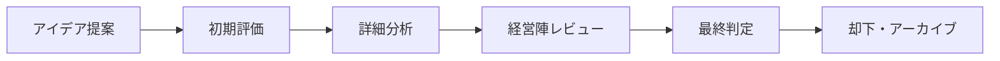

# 戦略的イノベーション・ナレッジリポジトリ
**AI Agent Health Monitor #26 担当領域**

## 🎯 却下アイデア活用戦略
- **学習資産の活用**: 失敗から学ぶイノベーション文化
- **未来への投資**: タイミング待ちアイデアの体系管理
- **意思決定透明性**: 判断基準・プロセスの可視化

## 📋 却下アイデア分析テンプレート

### 1. アイデア基本情報
| 項目 | 詳細 |
|------|------|
| **アイデア名** | [具体的なアイデア名・コンセプト] |
| **提案者** | [提案者名・部門] |
| **提案日** | [YYYY/MM/DD] |
| **カテゴリ** | 製品開発/サービス改善/事業戦略/技術革新 |
| **優先度** | 高/中/低 |

### 2. アイデア詳細・コンセプト
**📝 概要説明**
- **Problem Statement**: [解決しようとした課題]
- **Proposed Solution**: [提案された解決策]
- **Target Market**: [想定顧客・市場]
- **Value Proposition**: [提供価値・差別化ポイント]

### 3. 却下判定・分析

#### 却下理由分類
| 却下理由 | 詳細 | 重要度 |
|---------|------|--------|
| **📊 市場性不足** | 市場規模・需要が限定的 | 🔴🟡🟢 |
| **💰 収益性懸念** | ROI・採算性に問題 | 🔴🟡🟢 |
| **🔧 技術的困難** | 実現可能性・技術リスク | 🔴🟡🟢 |
| **⏰ タイミング不適** | 市場・社内準備未成熟 | 🔴🟡🟢 |
| **🎯 戦略不整合** | 企業戦略との乖離 | 🔴🟡🟢 |
| **💡 競合優位性不足** | 差別化・参入障壁欠如 | 🔴🟡🟢 |

#### 詳細分析マトリックス
```
┌─────────────────┬─────────┬─────────┬─────────┐
│    評価軸       │  高    │  中    │  低    │
├─────────────────┼─────────┼─────────┼─────────┤
│ 市場ポテンシャル  │   ○    │   △    │   ×    │
│ 実現可能性      │   ○    │   △    │   ×    │
│ 収益性         │   ○    │   △    │   ×    │
│ 戦略適合性      │   ○    │   △    │   ×    │
│ リソース要求度   │   ×    │   △    │   ○    │
└─────────────────┴─────────┴─────────┴─────────┘
```

### 4. 学習・洞察抽出

#### 📚 戦略的学習
- **市場理解**: [市場・顧客ニーズについての新たな発見]
- **技術洞察**: [技術的制約・可能性についての学び]
- **組織学習**: [意思決定プロセス・組織能力についての気づき]

#### 🔮 将来的可能性
- **条件変化シナリオ**: [どのような環境変化で再検討対象となるか]
- **技術進歩待ち**: [必要な技術革新・コスト低下]
- **市場成熟待ち**: [市場育成・顧客教育の進展]

### 5. 関連・派生アイデア

#### 🌱 発展的アイデア
- **スケールダウン版**: [リスクを下げた実証実験アプローチ]
- **部分的実装**: [コア機能のみの限定実装]
- **代替アプローチ**: [同じ課題への別解決策]

#### 🔗 他アイデアとの関連性
| 関連アイデア | 関係性 | 相乗効果の可能性 |
|-------------|--------|-----------------|
| [アイデアA] | 技術基盤共通 | 開発コスト削減 |
| [アイデアB] | 顧客セグメント重複 | クロスセル機会 |

### 6. 再評価・復活基準

#### 🎯 復活条件
- **市場条件**: [市場規模・需要の変化基準]
- **技術条件**: [必要技術の成熟度・コスト条件]
- **戦略条件**: [企業戦略・リソース状況の変化]
- **競合条件**: [競争環境・差別化機会の変化]

#### 📅 定期レビュー計画
- **レビュー頻度**: 年1回/半年1回/四半期1回
- **レビュー担当**: [部門・責任者]
- **評価指標**: [KPI・判断基準]

### 7. 意思決定プロセス記録

#### 🏛️ 評価・承認フロー


#### 👥 関与者・ステークホルダー
| 役割 | 担当者 | 貢献内容 |
|------|--------|----------|
| **提案者** | [名前] | アイデア創出・詳細化 |
| **評価者** | [名前] | 技術・市場分析 |
| **意思決定者** | [名前] | 最終判断・承認 |

---
💡 **AI Agent Health Monitor による継続的価値創出**
- 却下アイデアの定期的価値再評価
- 市場・技術トレンドとの自動マッチング
- 組織学習パターンの分析・改善提案
