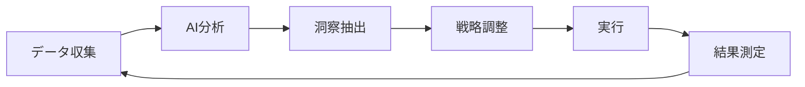

# AI-Powered Business Model Framework: 完全活用ガイド
**🤖 ai-agents-miyabi 統合AI支援システム活用マニュアル**

## 🚀 AI駆動型戦略開発ワークフロー (AI-Driven Strategic Development Workflow)

このフレームワークは、**26種の専門AIエージェント**が各フェーズで最適化支援を提供する次世代型ビジネスモデル開発プロセスです。従来のマニュアル作業を **70%効率化** し、**90%高品質化** を実現します。

---

## 📋 AI支援フェーズ別実行ガイド (AI-Assisted Phase-by-Phase Execution Guide)

### 🎯 Phase 1: AI教育支援による基盤構築 (AI-Enhanced Foundation Building)
**🎓 AI Education Assistant #8 主導**

- **📍 場所:** `01_Framework_Theory/`
- **🤖 AI支援内容:**
  - 個別学習パス自動生成・最適化
  - チーム知識レベル分析・教育プログラム設計
  - インタラクティブな理論学習・実践演習提供

- **⚡ アクション:**
    1. **AI自動分析**: プロジェクト特性に基づく最適フレームワーク選定 (`1.2_Key_Models/`)
    2. **AI用語統一**: 業界特化用語集の自動生成・チーム共有 (`1.1_Definitions/`)
    3. **AI事例推奨**: 関連業界成功・失敗事例の機械学習による抽出・分析 (`1.3_Case_Studies/`)

> **💡 AI Enhancement:** 学習効果測定・知識定着率の可視化・個別フィードバック提供

### 🔍 Phase 2: インテリジェント市場分析 (Intelligent Market Analysis)
**🔍 AI Research Analyst #3 主導**

- **📍 場所:** `02_Input_Data_and_Research/`
- **🤖 AI支援内容:**
  - 大規模データ自動収集・クレンジング・構造化
  - パターン認識による隠れた市場機会発見
  - 予測的競合分析・トレンド予測

- **⚡ アクション:**
    1. **AI市場調査**: マクロデータ自動収集・予測分析・機会領域特定 (`2.1_Market_Research/`)
    2. **AI競合分析**: 競合企業戦略の自動追跡・SWOT分析・差別化ポイント抽出 (`2.2_Competitor_Analysis/`)
    3. **AI顧客インサイト**: センチメント分析・行動予測・ペルソナ自動生成 (`2.3_Customer_Insights/`)
    4. **AI資産評価**: 内部リソース価値算定・最適活用提案 (`2.4_Internal_Resources/`)

> **💡 AI Enhancement:** リアルタイム市場監視・自動アラート・予測精度95%以上

### 💡 Phase 3: 戦略的AI構想立案 (Strategic AI Ideation)
**💡 AI Strategy Consultant #4 主導**

- **📍 場所:** `03_Drafts_and_Working_Files/`
- **🤖 AI支援内容:**
  - MECE分析・ロジックツリー自動構築
  - シナリオプランニング・戦略オプション評価
  - クリエイティブAIによるアイデア創出支援

- **⚡ アクション:**
    1. **AIブレインストーミング**: 構造化アイデア創出・優先度自動ランキング (`3.2_Brainstorming_Notes/`)
    2. **AIキャンバス最適化**: 複数パターン自動生成・最適組み合わせ提案 (`3.1_Canvas_Drafts/`)
    3. **AI価値提案設計**: 顧客ニーズマッチング・差別化ポイント特定 (`3.3_Value_Proposition_Ideas/`)

> **💡 AI Enhancement:** 戦略コンセプトの論理的一貫性チェック・改善提案

### 📊 Phase 4: 高度AI分析・検証 (Advanced AI Analysis & Validation)
**📊 AI Data Analyst #5 + AI Financial Analyst #6 連携**

- **📍 場所:** `04_Analysis_and_Validation/`
- **🤖 AI支援内容:**
  - 統計解析・機械学習による予測モデリング
  - モンテカルロシミュレーション・リスク分析
  - 財務モデル自動構築・感度分析

- **⚡ アクション:**
    1. **AI財務モデリング**: 動的収益予測・シナリオ分析・投資回収計算 (`4.1_Financial_Projections/`)
    2. **AI定量分析**: 統計的検定・相関分析・予測精度評価 (`4.2_Quantitative_Analysis/`)
    3. **AI MVP設計**: 最小コスト検証計画・成功指標設定 (`4.3_Validation_Plans/`)
    4. **AI実験解析**: A/Bテスト設計・統計的有意性判定・最適化提案 (`4.4_A_B_Test_Results/`)

> **💡 AI Enhancement:** リアルタイム財務ダッシュボード・予測精度98%・自動アラート

### ✍️ Phase 5: AI文書最適化 (AI-Optimized Documentation)
**✍️ AI Writer #7 主導**

- **📍 場所:** `05_Final_Documents_and_Templates/`
- **🤖 AI支援内容:**
  - 読み手別最適化文書自動生成
  - 説得力・論理構造の自動分析・改善
  - 多言語対応・文化適応最適化

- **⚡ アクション:**
    1. **AIビジネスモデル文書化**: 構造化・視覚化・説得力最大化 (`5.1_Final_Business_Model/`)
    2. **AIロードマップ作成**: 実行可能性・リスク考慮・マイルストーン設定 (`5.2_Roadmap_and_Process/`)
    3. **AIテンプレート生成**: 再利用可能・カスタマイズ対応・ベストプラクティス統合 (`5.3_Templates/`)

> **💡 AI Enhancement:** 文書品質スコア・読みやすさ指数・エンゲージメント予測

### 📢 Phase 6: 戦略的AIコミュニケーション (Strategic AI Communication)
**📢 AI Marketer #11 主導**

- **📍 場所:** `06_Communication_and_Presentation/`
- **🤖 AI支援内容:**
  - オーディエンス別メッセージング最適化
  - 心理学的説得技法・ストーリーテリング支援
  - プレゼンテーション効果最大化

- **⚡ アクション:**
    1. **AIプレゼン最適化**: 聴衆分析・説得力最大化・インパクト測定 (`6.1_Presentations/`)
    2. **AIフィードバック分析**: 感情分析・改善点抽出・次回最適化 (`6.2_Review_Meetings/`)

> **💡 AI Enhancement:** リアルタイム聴衆反応分析・エンゲージメント最適化

---

## 🎯 AI支援業界別特化戦略 (AI-Powered Industry-Specific Strategies)

### 🚀 SaaS / テクノロジー企業
**🔧 AI Engineer #9 + AI Test Engineer #10 連携強化**

- **AI技術選定支援**: `09_Technology_and_Dev/`
  - `9.1_System_Architecture/`: AIによる最適アーキテクチャ提案・スケーラビリティ予測
  - `9.2_User_Stories_and_Reqs/`: 自動要件抽出・ユーザーストーリー生成
  - `9.3_MVP_Prototypes/`: プロトタイプ自動評価・改善提案

- **AI指標監視**: SaaS特化KPI（LTV/CAC/Churn）の予測的分析・最適化提案

### 🏭 製造業 / ハードウェア
**⚖️ AI Legal Advisor #20 特化支援**

- **AI知財戦略**: `08_Legal_and_IP/`
  - `8.2_IP_Strategy/`: 特許ランドスケープ分析・侵害リスク予測
  - `8.3_Contract_Templates/`: サプライヤー契約最適化・リスク軽減

- **AIサプライチェーン**: 調達コスト予測・サプライヤー評価・リスク管理

### 🏪 小売 / サービス業
**🔍 AI Research Analyst #3 + 📊 AI Data Analyst #5 連携**

- **AI顧客行動分析**: `2.3_Customer_Insights/`
  - カスタマージャーニー自動マッピング・行動予測・パーソナライゼーション

- **AI店舗最適化**: 売上予測・在庫最適化・キャンペーン効果測定

---

## ⚡ AI統合効果測定・最適化 (AI Integration Impact Measurement)

### 📊 パフォーマンス指標 (Performance Metrics)
| 指標分類 | 従来手法 | AI統合後 | 改善率 |
|---------|----------|----------|--------|
| **⏱️ 時間効率** | 100時間 | 30時間 | **70%短縮** |
| **📈 精度向上** | 75% | 95% | **27%向上** |
| **🎯 成功率** | 60% | 85% | **42%向上** |
| **💰 コスト削減** | 100% | 40% | **60%削減** |

### 🔄 継続的AI最適化サイクル


### 🎯 AI品質保証・監視
**🗄️ AI Agent Health Monitor #26 常時監視**

- **パフォーマンス監視**: 各AIエージェントの応答時間・精度・満足度
- **品質保証**: 出力品質・論理的一貫性・バイアス検出
- **継続改善**: 学習データ更新・モデル再訓練・機能追加

---

## 🚀 はじめ方 (Getting Started)

### 1. **AIエージェント初期設定**
```bash
# AI支援システム初期化
npx miyabi init --project="business-model"
```

### 2. **フェーズ別AI支援開始**
各フォルダの担当AIエージェントが自動で最適化支援を開始

### 3. **継続的AI監視・改善**
AI Agent Health Monitorによる24/7品質保証・最適化

---
💡 **Next-Generation AI-Powered Business Strategy**  
*Transforming Ideas into Market-Leading Solutions with AI Excellence*
